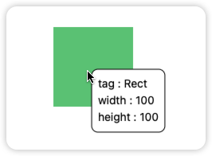
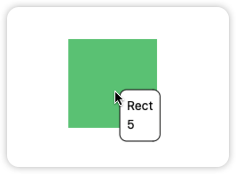
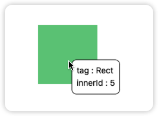
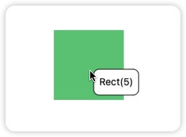
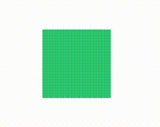
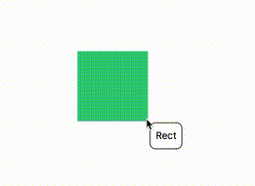
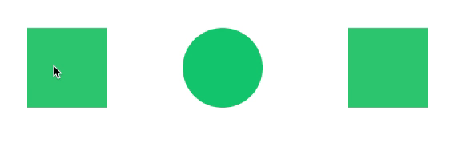
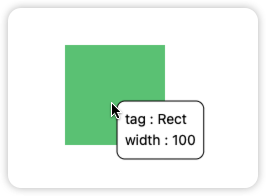
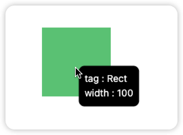
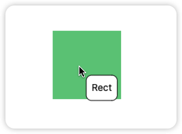

# leafer-x-tooltip-canvas

<p>
  English | <a href="./README.md">简体中文</a>
</p>

## Introduction

leafer-x-tooltip-canvas is a third-party tooltip plugin for [Leafer-ui](https://leaferjs.com/ui/), designed to display information to users.

<!-- - [在线体验（尚未完成）]() -->

## Quick Start

### Installation

```node
npm i leafer-x-tooltip-canvas --save
```

### Usage

When using the plugin, create an instance of the plugin and pass in an App or Leafer instance. (It is recommended to use App)

If an App is passed in, the popup will be drawn in the sky layer. If a Leafer is passed in, the popup will be drawn in the Leafer layer that is passed in.

> Note: If the sky layer has not been created when passing in App, it will be automatically created.

```js
import { TooltipPlugin } from 'leafer-x-tooltip-canvas'
const app = new App({ view: window })
const plugin = new TooltipPlugin(app)
```

### Config overview

Config can be passed as the second parameter when creating an instance of tooltipPlugin.

```js
new TooltipPlugin(app, {
  info: ['width', 'height', 'innerId'],
  includesType: ['Rect'],
  excludesType: [],
  ...
})
```

The specific config options are as follows. Click on the field name to jump to [Config Details](#Config details)

 <table class="styled-table jump-table">
  <thead>
    <tr>
      <th>Field</th>
      <th>Type</th>
      <th>Default</th>
      <th>Description</th>
    </tr>
  </thead>
  <tbody>
    <tr>
      <td><a href="#display-information">info</a></td>
      <td>Array&lt;string&gt;</td>
      <td>['tag']</td>
      <td>The attribute fields to be displayed</td>
    </tr>
  <tr>
      <td><a href="#display-type">showType</a></td>
      <td>'value'&#124;'key-value'</td>
      <td>'value'</td>
      <td>The way tooltip information is displayed</td>
    </tr>
    <tr>
      <td><a href="#formatter">formatter</a></td>
      <td>() => string</td>
      <td>() => undefined</td>
      <td>The function to format the content displayed in the tooltip</td>
    </tr>
    <tr>
      <td><a href="#delayed-displayhide">showDelay</a></td>
      <td>number</td>
      <td>500</td>
      <td>The time in milliseconds to delay before showing the tooltip</td>
    </tr>
    <tr>
      <td><a href="#delayed-displayhide">hideDelay</a></td>
      <td>number</td>
      <td>0</td>
      <td>The time in milliseconds to delay before hiding the tooltip</td>
    </tr>
    <tr>
      <td><a href="#includeexclude-types">includesType</a></td>
      <td>Array&lt;string&gt;</td>
      <td>[]</td>
      <td>The tags of elements that need to display the tooltip</td>
    </tr>
    <tr>
      <td><a href="#includeexclude-types">excludesType</a></td>
      <td>Array&lt;string&gt;</td>
      <td>[]</td>
      <td>The tags of elements that should not display the tooltip</td>
    </tr>
    <tr>
      <td><a href="#offset">offset</a></td>
      <td>Array&lt;number&gt;</td>
      <td>[5, 5]</td>
      <td>The offset of the tooltip relative to the position</td>
    </tr>
    <tr>
      <td><a href="#lightdark-themes">theme</a></td>
      <td>string</td>
      <td>'light'</td>
      <td>The theme of the tooltip, with the options being 'light' and 'dark'</td>
    </tr>
    <tr>
      <td><a href="#style">style</a></td>
      <td>IStyle</td>
      <td>see below</td>
      <td>The style configuration for the tooltip</td>
    </tr>
  </tbody>
</table>


IStyle Properties
<table class="styled-table">
    <tr>
        <th>Field</th>
        <th>Type</th>
        <th>Default</th>
        <th>Description</th>
    </tr>
    <tr>
        <td>backgroundColor</td>
        <td>string</td>
        <td>"white"</td>
        <td>The background color of the tooltip</td>
    </tr>
    <tr>
        <td>stroke</td>
        <td>string</td>
        <td>"black"</td>
        <td>The border color of the tooltip</td>
    </tr>
    <tr>
        <td>color</td>
        <td>string</td>
        <td>"black"</td>
        <td>The text color of the tooltip</td>
    </tr>
    <tr>
        <td>borderRadius</td>
        <td>number</td>
        <td>8</td>
        <td>The border radius of the tooltip for rounded corners</td>
    </tr>
    <tr>
        <td>padding</td>
        <td>number</td>
        <td>8</td>
        <td>The padding inside the tooltip</td>
    </tr>
    <tr>
        <td>fontSize</td>
        <td>number</td>
        <td>14</td>
        <td>The font size of the tooltip text</td>
    </tr>
    <tr>
        <td>fontWeight</td>
        <td>number</td>
        <td>400</td>
        <td>The font weight of the tooltip text, where 400 is normal and 700 is bold</td>
    </tr>
    <tr>
        <td>fontFamily</td>
        <td>string</td>
        <td>"Punctuation SC"</td>
        <td>The font family of the tooltip text, which can include multiple fonts separated by commas, similar to CSS font-family styling</td>
    </tr>
</table>

### Todo

- Display/Hide
  - [x] Basic Display/Hide
  - [x] Delayed Display/Hide
- Style
  - [ ] Triangle Arrow
  - [x] Light/Dark Themes
  - [x] Custom Style
- Position
  - [x] offset
  - [x] Custom Style
  - [ ] Relative to Element Position
  - [ ] Display Avoidance
- Information
  - [x] Custom Information
  - [x] formatter
- Interaction
  - [x] Include/Exclude Type Function
  - [ ] Trigger Method
  - [ ] Virtual Trigger

### Config details
<a href="#config-overview" class="fixed-right">:dizzy:Config Overview</a>

#### Content
##### Display Information
Configure the displayed attribute fields by passing in the `info` field.
<table class="center-table"> 
    <tr> 
        <td> 
            <span>info : ['tag','width','height']</span>
        </td> 
        <td> 
            
        </td> 
   </tr> 
</table>

##### Display Type
Configure the display method of the information, there are two types: `value`,`key-value`.
<table class="center-table"> 
    <tr> 
        <td> 
            <span>showType : 'value'</span>
        </td> 
        <td> 
            
        </td> 
   </tr> 
   <tr> 
      <td>
          <span>showType : 'key-value'</span>
      </td>
      <td>
          
      </td>
    </tr>
</table>

##### Formatter 
Configure the formatting function for the information, the parameter is the attribute collection of the element being acted upon. The returned value serves as the text for the tooltip.

```js
formatter: (item) => {
    return `${item.tag}(${item.innerId})`
}
```
 

#### Display/Hide
##### Delayed Display/Hide
Configure the delay time for display and the delay time for hiding.
<table class="center-table"> 
    <tr> 
        <td> 
            <span>showDelay : 500</span>
        </td> 
        <td> 
            
        </td> 
   </tr> 
   <tr> 
      <td>
          <span>hideDelay : 500</span>
      </td>
      <td>
          
      </td>
    </tr>
</table>

#### Interaction
##### Include/Exclude Types
Configure the element tags to be displayed/hidden by setting the `includesType` and `excludesType` property.

- When only `includesType` is configured, only the elements configured in `includesType` are displayed.
- When only `excludesType` is configured, only the elements configured in `excludesType` are not displayed.
- Both `includesType` and `excludesType` can be configured at the same time.
- The priority of `includesType` is higher than `excludesType`.
 <table class="center-table"> 
    <tr> 
        <td> 
            <span>includesType : ['Rect']</span>
        </td> 
        <td> 
            
        </td> 
   </tr> 
</table>


#### Style
##### Light/Dark Themes
The plugin provides two themes by default, `light` and `dark`, which can be switched by configuring the theme field. The default theme is light.
 <table class="center-table"> 
    <tr> 
        <td> 
            <span>theme : 'light'</span>
        </td> 
        <td> 
            
        </td> 
   </tr> 
   <tr> 
      <td>
          <span>theme : 'dark'</span>
      </td>
      <td>
          
      </td>
    </tr>
</table>

#### Position
##### Offset
Configure the offset of the tooltip relative to the mouse position, the first parameter is the offset on the x-axis, and the second parameter is the offset on the y-axis.
<table class="center-table"> 
    <tr> 
        <td> 
            <span>offset : [10,20]</span>
        </td> 
        <td> 
            
        </td> 
   </tr> 
</table>

##### Custom Style
Users can customize the style by configuring the `style` field.
<table class="center-table"> 
</table>
   <tr> 
      <td>
          <span>

    style: {
        backgroundColor: '#32cd79',
        stroke: '#32cd79',
        color: 'white',
        borderRadius: 16,
        padding: 8,
        fontSize: 16,
        fontWeight: 400,
    }
  </span>
      </td>
      <td>
          
      </td>
    </tr>
</table>


[Github](https://github.com/214L/leafer-x-popup-canvas)


<style> 
.center-table { 
    margin-left: auto; 
    margin-right: auto; 
} 
.center-table td {
    border: 0px; 
} 
.center-table span {
    background-color: rgb(220,220,220); 
    padding: 2px 5px 2px 5px;
}

.styled-table {
    width: 100%;
    border-collapse: collapse;
    text-align: center; /* 文字居中 */
  }
  .styled-table th, .styled-table td {
    border: 1px solid #ddd; /* 边框颜色 */
    padding: 8px; /* 单元格内边距 */
  }
  .styled-table tr:nth-child(even) {
    background-color: #f2f2f2; /* 斑马格效果 */
  }
  .jump-table th:first-child:hover, .styled-table td:first-child:hover {
    cursor: pointer;
  }
  .fixed-right {
    position: fixed;
    bottom: 20%;
    right: 10px;
    transform: translateY(-50%);
}**
</style>
